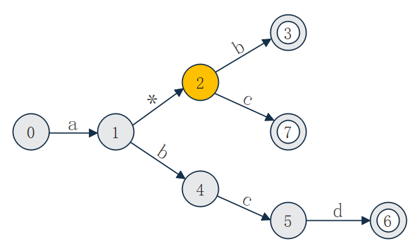

## 问题背景
软件系统中通常都会包括访问控制（ACL）的功能，在访问控制中又难免
会有黑白名单的过滤，包括IP地址、用户名、URL等的过滤。类似这样的过滤
列表可能会有上百条，如何高效匹配过滤列表对系统性能至关重要。

## 问题描述
问题抽象成字符串的匹配问题，但待匹配的字符串有多条并且存在以下三种
模式：
1. 普通字符串（精准匹配）
比如: `abc`, `hello`, `www.baidu.com`, ...
2. 字符串头部或尾部包含通配符'*'，此通配符可以匹配0个或多个任意字符
比如: `192.168.0.*`, `*.baidu.com`
3. 字符串任意位置存在通配符
比如: `192.168.*.255`, `192.168.*.*`, `www.*.com`

## 交付要求
1. 使用C++语言进行交付(不限版本C++98, 11, 14, 17皆可，但须注明)
2. 过滤列表保存在文本文件中作为输入，每行表示一个待过滤串
3. 交付一个socket服务端和客户端程序  
    a) 服务端通过socket暴露如下接口（接口自行定义）  
        i. 查询接口：查询字符串是否匹配过滤列表  
        ii. 过滤列表的增加和删除接口  
    b) 客户端通过socket接口发起查询和过滤列表的增加以及删除  
4. 字符串的三种模式可以认为是不断进阶的需求
5. 重点考虑系统查询性能，注重代码风格和架构设计 

## 解决方案

### 非确定型自动机（NFA）

由于通配符*的存在，状态转移是非确定型的。  

#### 举例
用`a*b`, `abcd`, `a*c`构造NFA



#### 数据结构
```cpp
struct Node
{
    int endc;
    bool is_cycle;
    int count;
    MAP mp;
};
class Nfa
{
    std::vector<Node> nodes;
    std::set<std::string> rules;
};
```

#### 主要方法
```cpp
class Nfa
{
public:
    int Insert_Rule(const char buf[]);
    int Delete_Rule(const char buf[]);
    int Query(const char buf[]);
    int Parse_Data(char* recv, char* send, int& len);
};

```

### Socket接口协议

有关接口协议的内容包含在 `source\NProtocol.h` 中。
消息结构体包括消息头和消息体两部分。

- 消息头
    - protocol = 'n'         
    表示此消息为本协议的消息
    - version = '1'          
    表示为第一个版本的协议
    - pkgFlag = 'h'或'i'     
    表示此消息为心跳包或非心跳包
    - command = 'a','d'或'q'  
    表示本消息为增加规则、删除规则或查询请求
    - datalen  
    表示消息体的长度
- 消息体  
    - body = "a*b" 或 "abbcd" 等  
    当 command 合法时，表示具体的规则或请求

#### 心跳协议

若无消息传递，则每隔5s发送一次心跳包维持连接。  
服务端超过30s未收到客户端发来的心跳则断开连接。


### 服务端
调用Nfa Class提供查询与增删规则功能。Listen_Thread监听是否有客户端接入，若有Socket接入则开启Handle_Thread处理。每个Handle_Thread互不干扰。


### 客户端

设置双线程
- Work_Thread         从过滤列表里读取增加规则的请求，或键入请求
- HeartBeat_Thread    无请求时保持连接，发送心跳包


### CS 交互


### Cmake

可支持跨平台编译。

### Test

- NFA Test Case
    - Normal Test, assert
    - Repeat insert & delete
- Server die 
    - 客户端发送心跳显示连接已断开
- Client die
    - 服务端通过心跳协议无响应中断连接
